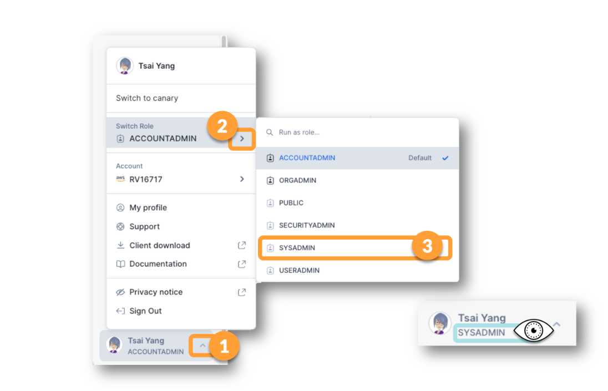
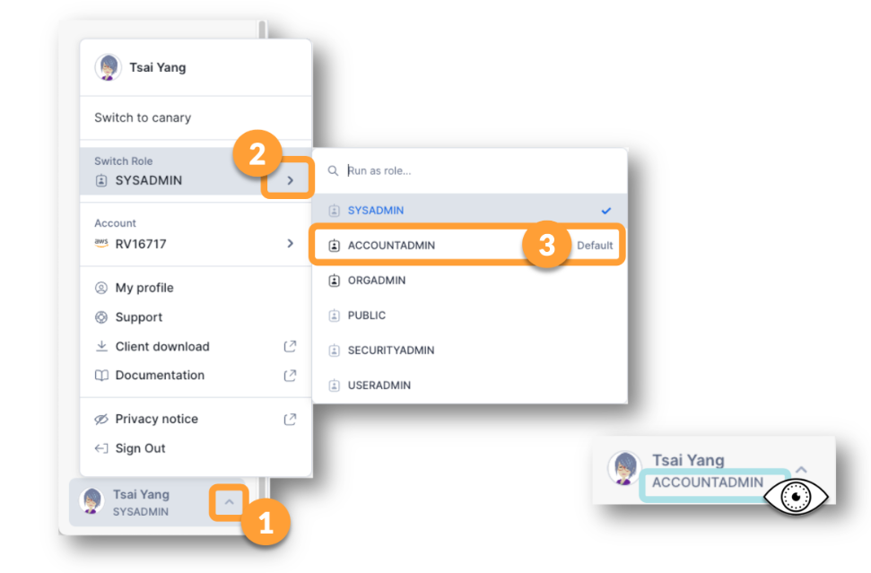
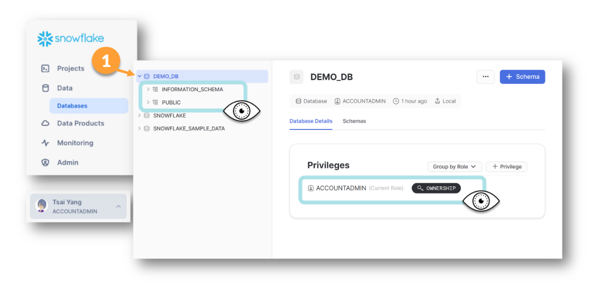
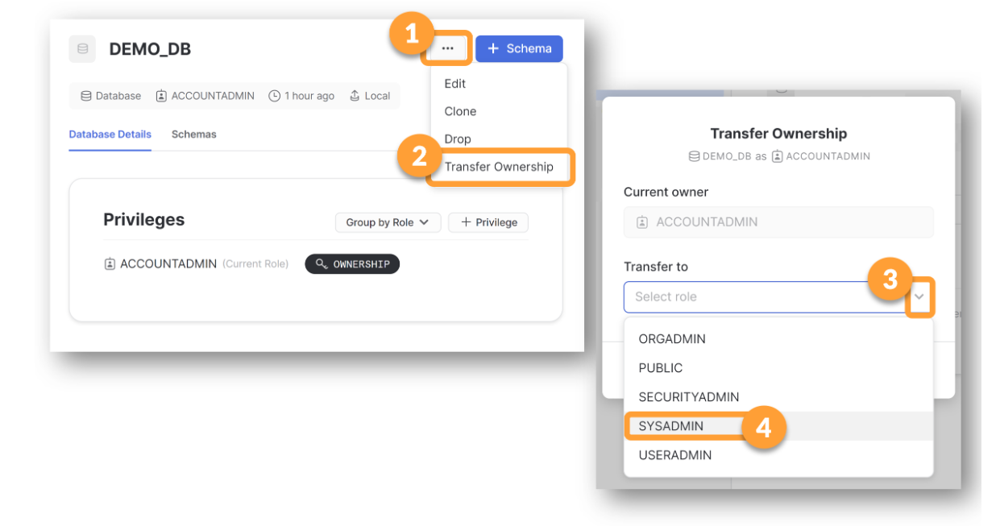
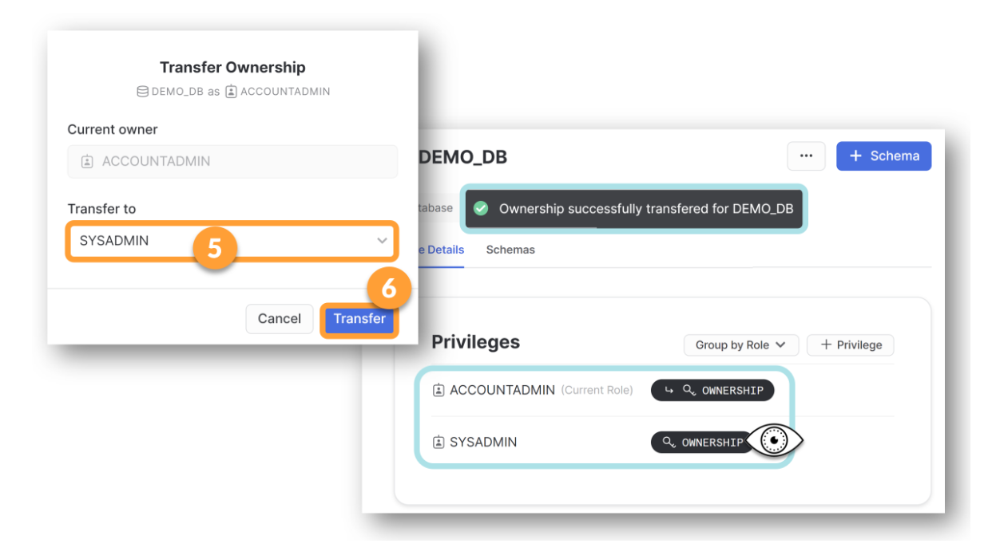
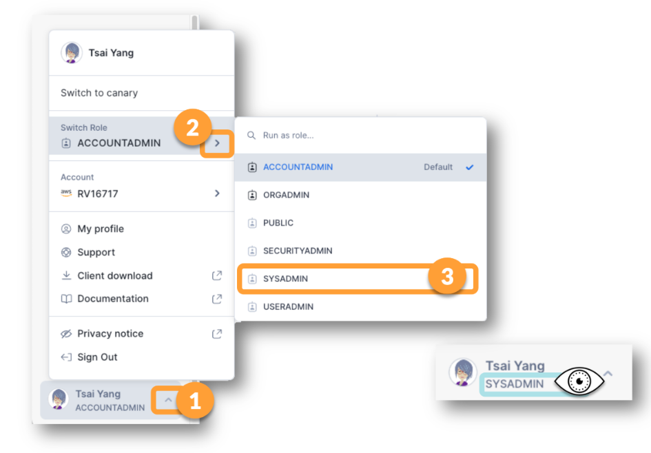
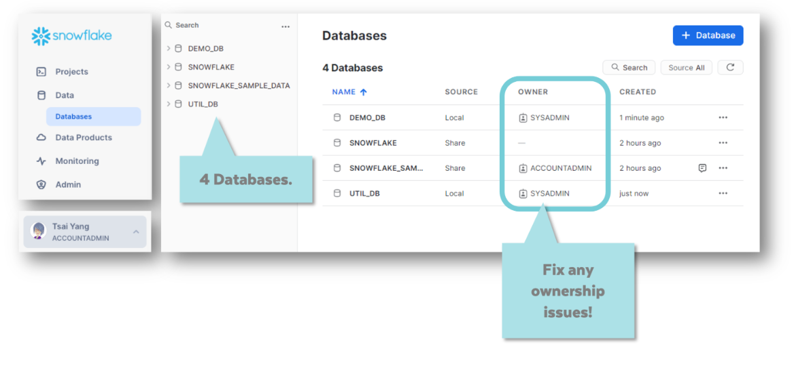
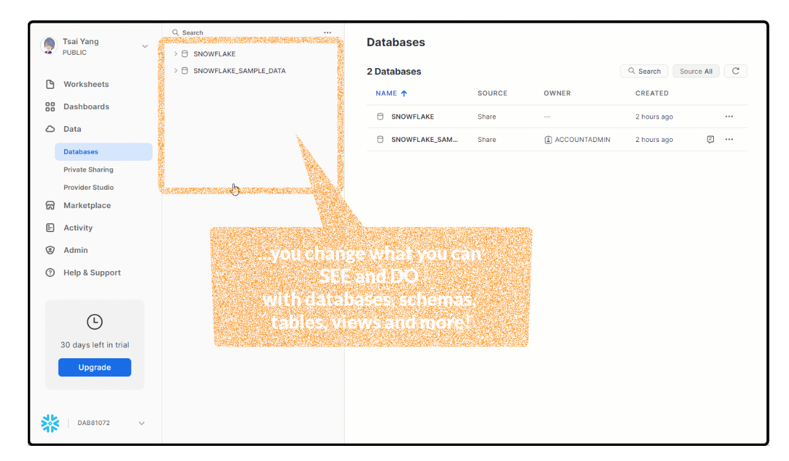
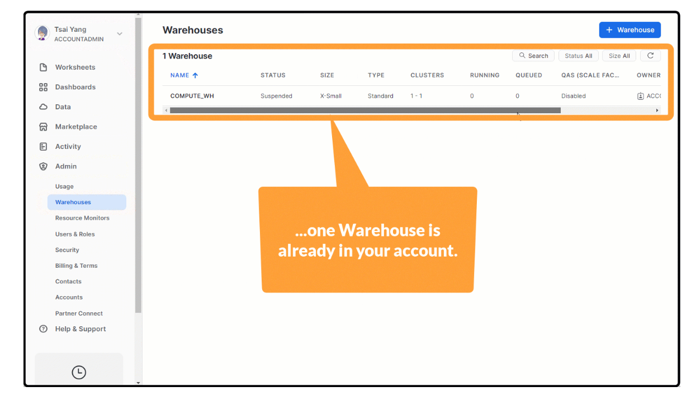
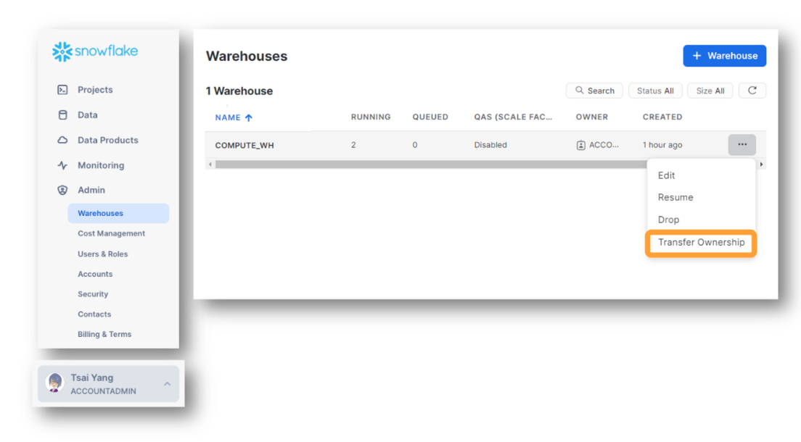

# Lesson 2 : Identity And Access

[up](../readme.md)

## Identity, Access, Users, & Roles
> Identity and access differ in that one is about who you are and the others about what you're allowed to see or do. If you can prove your identity, that's called being authenticated. If you can prove you have a right to access something, that's called being authorized. When we talk about authentication and authorization, these two steps can seem like they're happening at the same time, but they're actually separate processes.

> As software has moved to the Internet, or cloud, security technologies have become more sophisticated and these two steps have become more separate. So let's imagine the processes of authentication and authorization as a couple of conversations. First, a human name Tsai shows up on the doorstep of Snowflake asking for access. But to get access, she has to identify herself.

> It's the job of the authenticator to decide whether she is who she says she is. She claims to know certain information and she wants to use what she knows to prove her identity. She provides the information and the Authenticator checks it and approves. She's gone from being a human being named Tsai, to being an authenticated Snowflake user named TYANG.

> She also believes she's authorized, but the Authenticators job is over and he's left the chat. If TYANG actually wants to use Snowflake, she'll need to get permissions from the Authorizer. TYANG introduces herself and she's hoping the Authorizer will give her the go ahead to roam free. But the Authorizer doesn't actually know or care anything about TYANG because of something called Role-Based Access Control.

> Role-based access control, or RBAC for short, is like a barrier between the user and the authorizer. Roles are assigned to users and users can switch between the different roles so that when TYANG wants to carry out a task, the Authorizer will either allow or deny the task based on her current role.

> One of the most powerful features of Snowflake is that users can switch between roles without needing to log in and out of Snowflake. Changing her role is as easy as picking it from a menu. As you change roles, you're likely to notice that you gain and lose access to some types of information. The role with the most access and power is the acount administrator or ACCOUNTADMIN role.

> As a trial account user, you're automatically assigned the ACCOUNTADMIN role, and because of something called RBAC inheritance, this means you'll automatically get all the other predefined Snowflake roles as well. If Tsai's company decides to start using Snowflake, Tsai is likely to be restricted to the SYSADMIN role. Different people within her company will be assigned the SECURITYADMIN and USERADMIN roles. A few people in her company will probably have the ACCOUNTADMIN role and they'll likely only use that role in very specific situations. You may want to think of roles as hats, where ACCOUNTADMIN is the hat with the highest level of power and control. The SECURITY and USERADMINS are hats for gatekeeping or enforcement and SYSADMIN is a hat for creating.

> The SYSADMIN role is most often used to create databases and tables as well as warehouses. So when your trial was created, even though you were given all the roles, your default role was set to SYSADMIN. Even when you set your role to ACCOUNTADMIN, you'll notice it keeps getting set back to SYSADMIN, you can update your default role, but it's also good to just get accustomed to checking your role settings any time you see something unexpected.

> For example, if you create a table and then Snowflake says the table doesn't exist, check your role setting. So let's review: Identity is about the user, the username and password, if you will. It happens once, when you first log in and the outcome of that process is authentication. Access is about the role. It happens continuously while you use Snowflake.

> And the outcome each time, if successful, is authorization. Snowflake accounts come with five predefined RBAC roles. And of course, you can also create your own custom roles. ACCOUNTADMIN is the highest level role with the most power. If you're assigned ACCOUNTADMIN, you automatically also get all of the other roles. SYSADMIN is set as the default role for all trial account login users and the first rule of troubleshooting in Snowflake is: Check your role!


> IDENTITY -> user dan password

> ACCESS ->  role

> Snowflake comes with 5 predefined roles 


## Snowflake's Predefined Roles

### 🥋 Learning About Snowflake System Roles

> 

> Use the Roles diagram to explore the roles that have been assigned to you. Notice that in the diagram, some roles are linked to others in what looks like an org chart or family tree. This is because some roles get subsets of rights from other roles. 

#### ROLE CREATION AS INHERITANCE

> [When Thierry and Benoit were first setting up Snowflake ROLES in Benoit's apartment](https://www.youtube.com/watch?v=Y05ZNHwvfsg&ab_channel=SnowflakeInc.) they created the all-powerful ACCOUNTADMIN. Then, like a parent, giving some DNA to one child and some DNA to another, they set up system ROLES like SECURITYADMIN and SYSADMIN. 

> In this way, when ROLES are first designed, there is the idea of setting up different "children" to inherit from "parents" just as you might dole out DNA, or assets in a Last Will and Testament. 

### 📓BOGO Roles for New Users!

> As a new Snowflake Trial Account USER, you are given the ACCOUNTADMIN ROLE  by the Trial provisioning process.

> And again, because of the way those ROLES were originally designed (a long time ago by Thierry and Benoit), you automatically get the roles that are below ACCOUNTADMIN in that chart. This is also often referred to as "role inheritance," but we don't think the inheritance metaphor is helpful here. We think the metaphor of inheritance works great during role creation but not as well during role assignment. We think using that term during role assignment leads to some critical misunderstandings.  

> See, with DNA or property inheritance, things often move from an older and more powerful person and end up in the hands of someone younger and less powerful. So there is a downward flow implied by the word inheritance. 

> With these automatically-awarded Snowflake roles, their use feels more like Buy One Get One Free promotion (BOGO!) at a fast food place!

> Giving SYSADMIN as a free perk to an all-powerful ACCOUNTADMIN feels more like a free bag of chips with the purchase of a sandwich. So, instead of the "role inheritance" we think it's amusing to refer to the lower roles as BOGO roles. Because technically, you aren't giving ACCOUNTADMIN anything, other than the chance to pretend they have less power than they actually do. That doesn't feel like inheritance. 

#### BECAUSE OF BOGO, HIGHER ROLES CAN IMPERSONATE LOWER ROLES 

> Once we have those BOGO ROLES in our drop-list of ROLE options, the action of switching to a lower role could be thought of as "impersonation." And we can say that a higher role can impersonate a lower role anytime they want. In your Trial Account, you can impersonate a SYSADMIN by setting your role to SYSADMIN.  This impersonation power only flows downward in the chart or tree. If you had been awarded SYSADMIN directly, you would not be able to impersonate ACCOUNTADMIN.  

### 📓 Discretionary Access Control (DAC)
>Beyond RBAC, there is another facet of Snowflake's access model called Discretionary Access Control (DAC), which means "you create it, you own it." If SYSADMIN creates a database, they own it and so they can delete it, change the name, and more.  

>We see DAC models when we create an MS Word Doc, an email or a Google Sheets document. We created it, so we own it. We created it, so we can delete it! We created it, so we can rename it!

>Because of the combination of RBAC and DAC in Snowflake, when we create something, the ROLE we were using at the time we created it, is the role that OWNS it. 


### 📓 Higher Roles Have Custodial Oversight
>Imagine your child was given a t-shirt at their school as a free promotion, and when they arrived home, you took the t-shirt from them and threw it in the trash. That sounds like a crazy parenting choice, and one that might make your kid cry, but hear us out. The child says, "But that was my t-shirt!" and you say, "As your parent, anything you own, is actually owned by me until you are 18 years old!!" 

>In that sense, it could be said that any possession of a child is legally "inherited" by the parent. But again, "inherit" doesn't seem like the best metaphor here. 

>As parents, we definitely have the right to enter our children's bedrooms and look around. We can rearrange things, put locks on the doors, remove items, paint the walls, and more. Legally, these are sometimes called "custodial rights" and our decisions can fall under "custodial oversight." 

>Think of ACCOUNTADMIN as a sort of "parent" of SYSADMIN, with "custodial rights." SYSADMIN can create a database and by creating it, they are the OWNER of that database. But because SYSADMIN is a "child" of ACCOUNTADMIN, ACCOUNTADMIN can take the database away from SYSADMIN and give it to a SECURITYADMIN if they want to.

>ACCOUNTADMIN can also delete something owned by SYSADMIN, rename it, or carry out any other task on anything created or owned by SYSADMIN. SYSADMIN cannot do the same things to items owned by ACCOUNTADMIN. 


### 📓 Default Role Assignment
> Totally unrelated to any other rules of ROLE design, hierarchy, inheritance, BOGO, or custodial oversight, there is the concept of a DEFAULT ROLE. This is a USER setting that is designed for convenience. Each USER has a role assigned as their default. The default role that has been assigned to you as a Trial Account User is the ACCOUNTADMIN role. This just means that each time you log in to Snowflake, your role will be set to ACCOUNTADMIN. You can change your default role to something different but we don't recommend you do that for your trial account because we have written the workshop labs with the presumption that you will use ACCOUNTADMIN for most tasks. 

### 📓 Role Hierarchy Rules Review

If two ROLES are linked by a blue line: 

- The higher role can be DIRECTLY given to a USER and the USER will automatically (BOGO!) be awarded all the lower roles in the same org chart or family tree.
- If a USER has a higher role, they will be able to impersonate all lower ROLES in the same linked tree, without being explicitly given those ROLES.  
- The higher role has custodial oversight of all objects OWNED by a linked, lower role.
- Each USER has a default role they are assigned. This is the ROLE they are set to each time they log in. It doesn't do much more than that, so it is convenience, only and does not affect the current role a user is using. 

## Create Database 
### 🥋 Create a New Database

>

>

### 🥋 Switch Your System Role to SYSADMIN

> 

>You may need to refresh the browser tab to see the role change effects. You may also see a "Body can't be empty" message because you are on a database that the SYSADMIN can't see as soon as you change the role.


## Explore Your New Database

### 🥋 Switch Your System Role Back to ACCOUNTADMIN
> 

>You may need to refresh the browser tab to make sure the role change has taken effect. 

### 🥋 Explore the Database You Created

> 

> Databases are used to group datasets (tables) together. A second-level organizational grouping, within a database, is called a schema. Every time you create a database, Snowflake will automatically create two schemas for you.

> The INFORMATION_SCHEMA schema holds a collection of views.  The INFORMATION_SCHEMA schema cannot be deleted (dropped), renamed, or moved.

> The PUBLIC schema is created empty and you can fill it with tables, views and other things over time. The PUBLIC schema can be dropped, renamed, or moved at any time.  

## 🥋 Transfer Ownership of Your Database to the SYSADMIN Role

### 🥋 Transfer Ownership of Your Database to the SYSADMIN Role

> 
>
> 

### 🥋 Switch Your System Role Back to SYSADMIN

>

> You will likely want to refresh the browser tab after changing roles each time. 

## Ownership Challenge

> This is a Challenge Lab! Challenge Labs are different from other labs because we don't give you the step-by-step instructions. Instead, we give you the end goal and expect you to use the skills you learned in earlier labs to complete the work. Challenge labs are required. 

> Good Luck!

```
grant ownership on schema public to role SYSADMIN; 
```

## 🎯 Role, Creation, & Ownership Challenge Lab!

###  🎯 Create a New Database Called UTIL_DB

>Create a new database and name it UTIL_DB. This database and the PUBLIC schema should be owned by SYSADMIN.

> HINT: If you set your role to SYSADMIN before you create the database, it will automatically be owned by SYSADMIN. You won't have to do any transfers of ownership. If you forget to set your role to SYSADMIN before creating the UTIL_DB, you will need to transfer ownership to SYSADMIN. 

#### Does Your Databases Page Look Like This, Now?
>It should. 


> Review previous lesson labs if your databases page doesn't look like this. When you have confirmed your databases, click the [Mark as Complete] button below. 

## Roles And Database Visibility 

>As public view.


>1. View the list of Databases.
>2. Change your role. 
>3. Notice that for some roles, not all 4 databases are visible. 

> NOTE: Many times when using Snowflake, something might seem to disappear. You may see a "Does Not Exist error" when you know that the item in question has been created. In those instances, you should begin by checking your role!!

## Roles And Warehouse Visibility

### 📓 How Does Changing Your Role Affect What Warehouses You Can See? 



> 1. Start with your role set to ACCOUNTADMIN. 
> 2. Navigate to the Warehouses page. 
> 3. View a warehouse added to your trial for you. 
> 4. Change ROLE other roles, notice no warehouses are listed.

### 🎯 CHALLENGE LAB: Make the Warehouse Available to SYSADMIN 

> There are different ways to make a compute resource available to different roles, but as we saw with databases, sometimes the easiest way to grant access is to transfer ownership to a lower role and let higher roles "inherit" it (use it via custodial oversight).

> Give the SYSADMIN role access to the COMPUTE_WH. 




### 🏁 Are You Ready for Lesson 3? 

If you: 

Can switch between roles on the HOME page 
Can see and use the COMPUTE_WH warehouse while in the SYSADMIN role
Can name the first rule of troubleshooting in Snowflake ("Check your ____")  "ROLES"
You are ready for Lesson 3!


