# Lesson 3 : Data Containers

## 🎭 Uncle Yer's Plant Shop

> Tsai is on her way home from work, when she gets a call from her Uncle Yer, she agrees to stop by and help him with a data problem he's been having. Uncle Yer has a plant shop and vegetable stand. He keeps meticulous records and uses his gardening expertise to advise his customers. Last year, Uncle Yer's plants were doing great, but his records were becoming impossible to navigate.

>That's when Tsai showed him how to move his data off of paper and into spreadsheets. Uncle Yer loved using the spreadsheets and even taught himself to use spreadsheet functions. Lately, though, he's been trying to combine the data from different spreadsheets so he can start analyzing his data in more complex ways. With each new issue her uncle has encountered,Tsai's been wondering if maybe he's outgrown spreadsheets and should move into databases.

> Then again, she's held back because she's worried that database concepts might be too complex for him or that database software licenses would cost too much money up front. As Uncle Yer begins to explain his latest challenge, Tsai realizes his Snowflake might be the perfect solution for him. Uncle Yer currently has two folders for his spreadsheets, one is named House Plants, and the other is called Garden Plants.

> Within his Garden Plants folder, he has a vegetable workbook, a fruits workbook, and a flowers workbook. Each workbook has several sheets. For example, in the vegetables workbook, there's a sheet for plant height, a sheet for root depth, a sheet for soil needs, and several others. Tsai explains that the folders, files, and worksheets form a hierarchy of data containers.

> The sheets are contained in the workbooks, and the workbooks are contained in the folders. Then she explains that database systems have similar hierarchies. Sheets are called tables, collections of tables are called schemas, and collections of schemas are called databases. To move his current data into Snowflake, Tsai suggests they start by creating a database called Garden Plants.

> They'll create schemas for each of his existing workbooks and tables for each of his sheets. Then they'll load the spreadsheet data into the tables.


## 🥋 Creating Databases, Dropping & Creating Schemas
### 🥋 LAB DEMONSTRATION

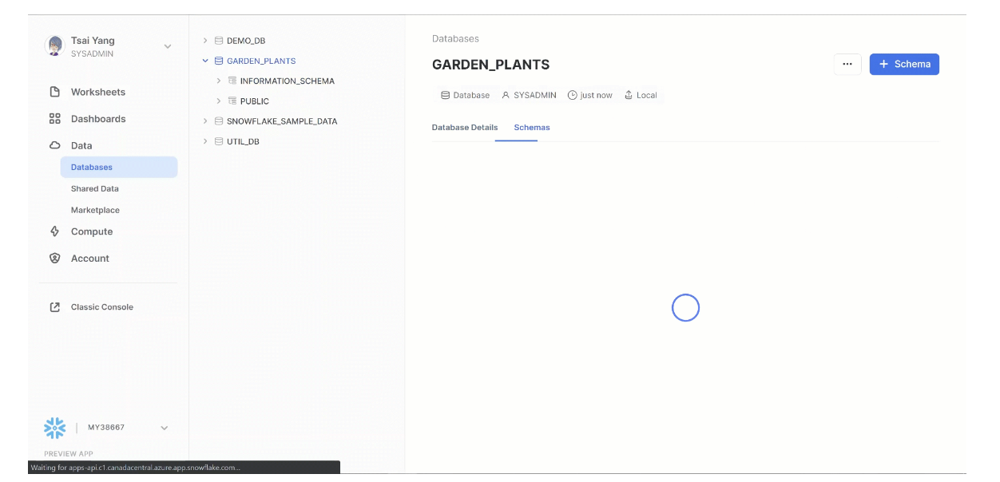

### 🥋 LAB STEP-BY-STEP  (as shown above)


>1. Set your role to SYSADMIN.
>2. Create a Database and name it GARDEN_PLANTS.
>3. Drop the PUBLIC schema that was automatically created when you created your GARDEN_PLANTS database. 
>4. Create three new schemas in your GARDEN_PLANTS database. Name them VEGGIES, FRUITS and FLOWERS.

>> NOTE: "Drop" is the same as "Delete."

## 🥋 Create a Worksheet & Run Some Code
### 🥋 Create a Worksheet & Run Some Code

>> NOTE: Snowflake now offers SQL and Python Worksheets. Please choose SQL Worksheets throughout this course. 

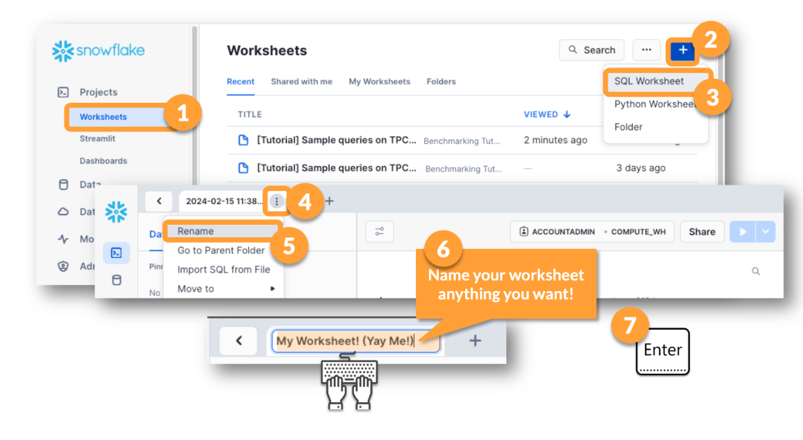

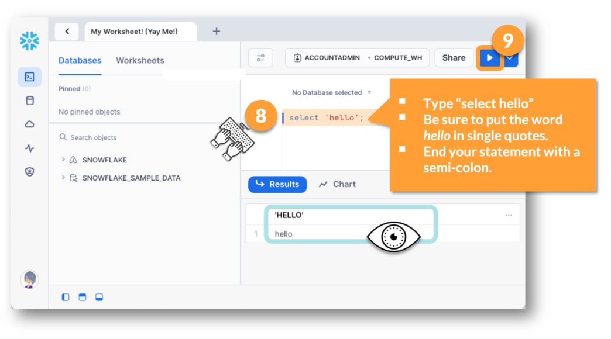

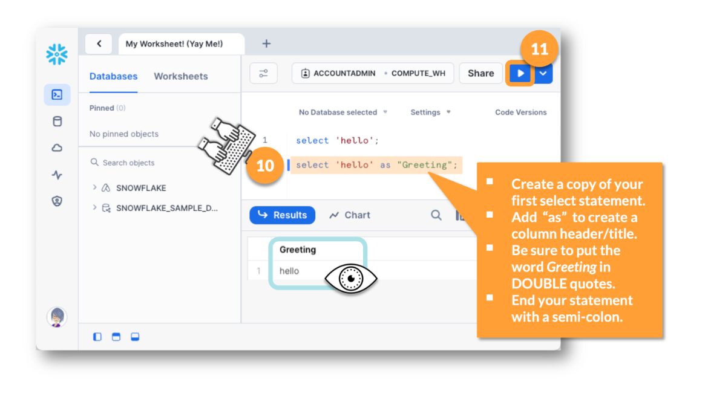


### 📓 Worksheet Context Menus

>Every worksheet has 4 drop menus near the top. Two are in the upper right corner and two are close to the first line of code. Which two are near the code? Which two are in the upper right corner? 

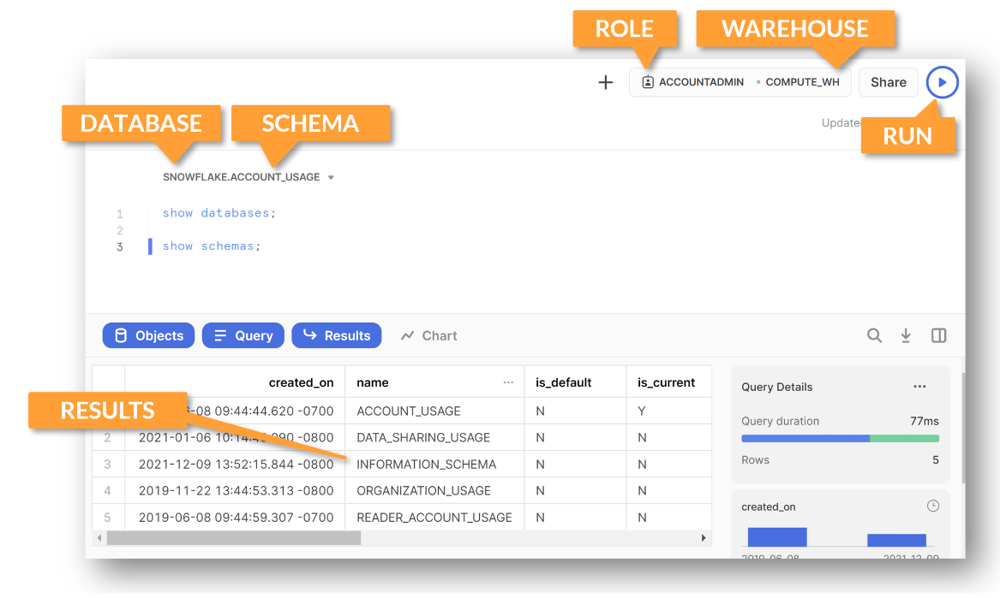

>Troubleshooting a DOES NOT EXIST error? These four drop menus are a great place to start!! 


## 📓 Knowing What Will Run
### 📓 Knowing What Will Run & What Has Recently Run
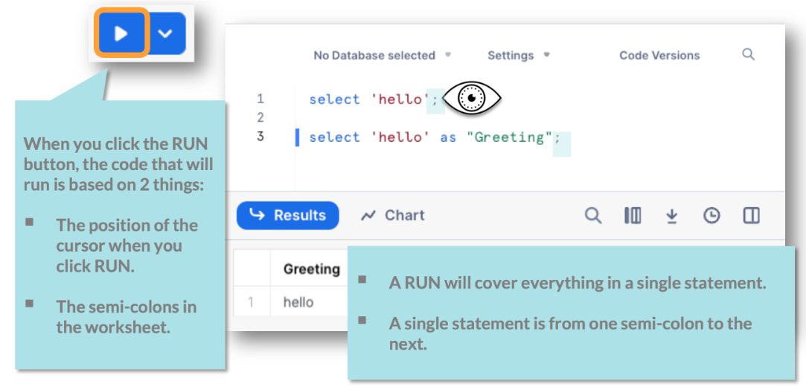
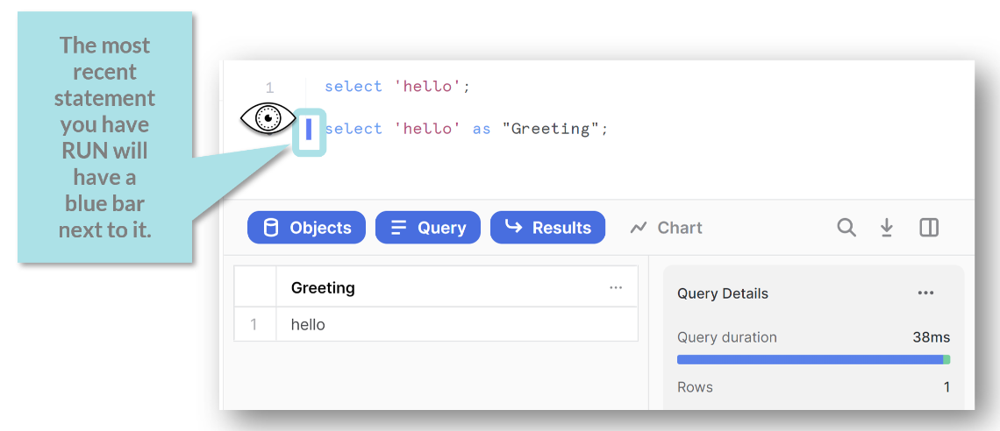
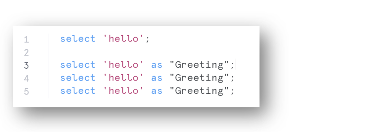


## 🥋 Running SHOW Commands
### 📓 The Object Pickers
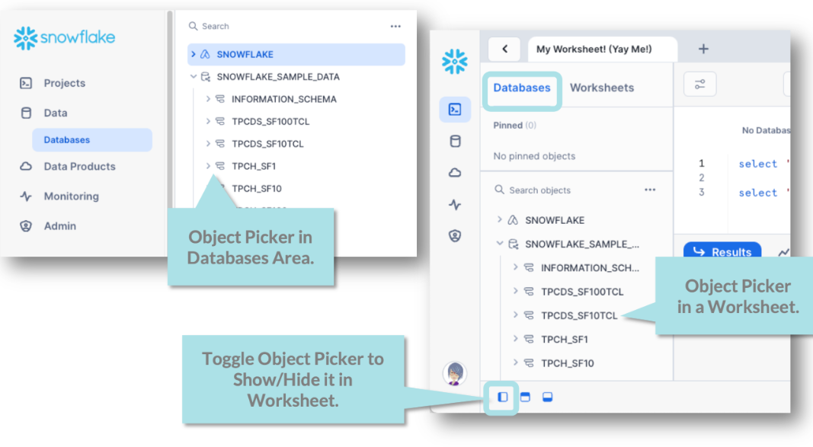

> Object Pickers help you locate and pick objects. "Objects" is a generic terms for databases, schemas, tables, views and much more! 

### 🥋 Run the SHOW DATABASES Command

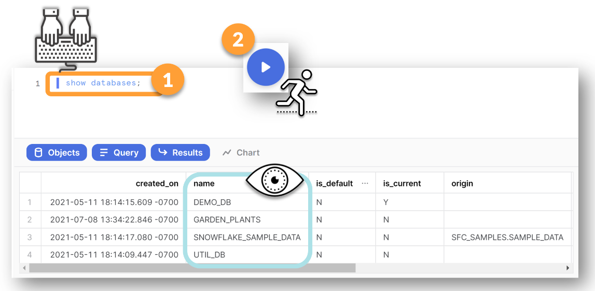

> Running a SHOW DATABASES command is just like being at the first level of an Object Picker (but with more details, and the ability to cut and paste the info into a spreadsheet). 

### 🥋 Run the SHOW SCHEMAS Command
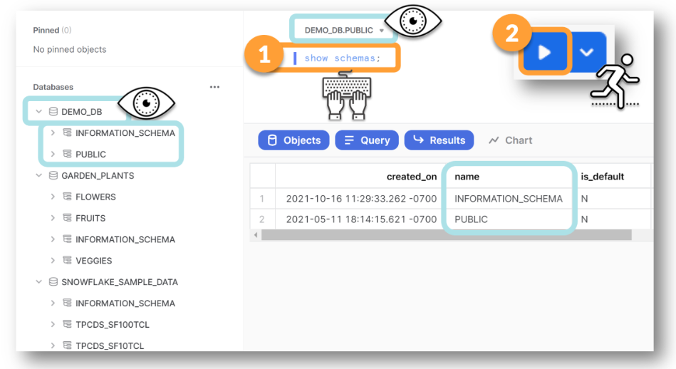

> Running a SHOW SCHEMAS command is somewhat like being at the second level of an Object Picker. The difference is that the menu just above the code dictates which database you will get the SCHEMAS from. 

### 🥋 Change the Database Context and Run the SHOW SCHEMAS Command Again

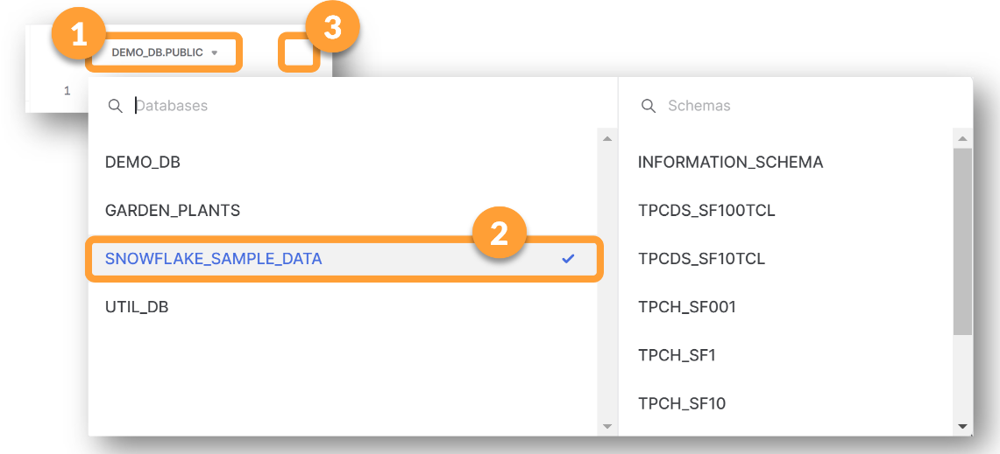

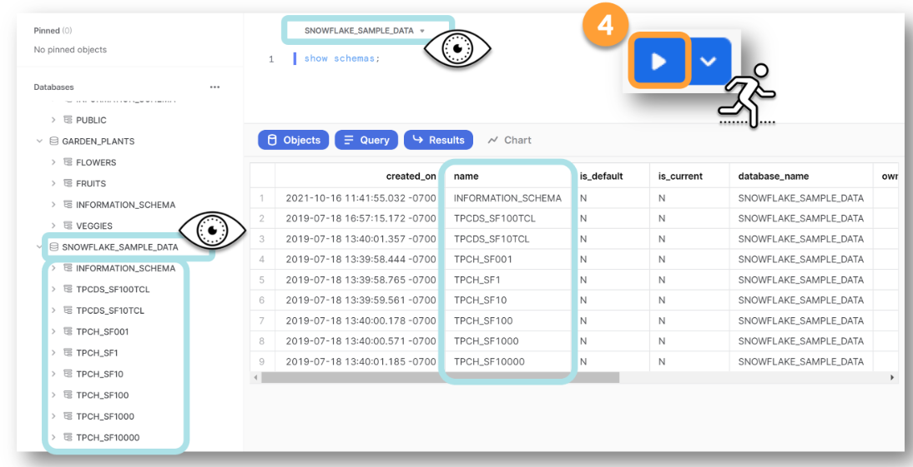


> There is another SHOW SCHEMAS command. This one is ```SHOW SCHEMAS IN ACCOUNT```.

> What happens if you add "IN ACCOUNT" to your command? How does the context menu affect the results? 

## 🎯 Lesson 3 Challenge Lab
### 🎯 Check Your Work So Far

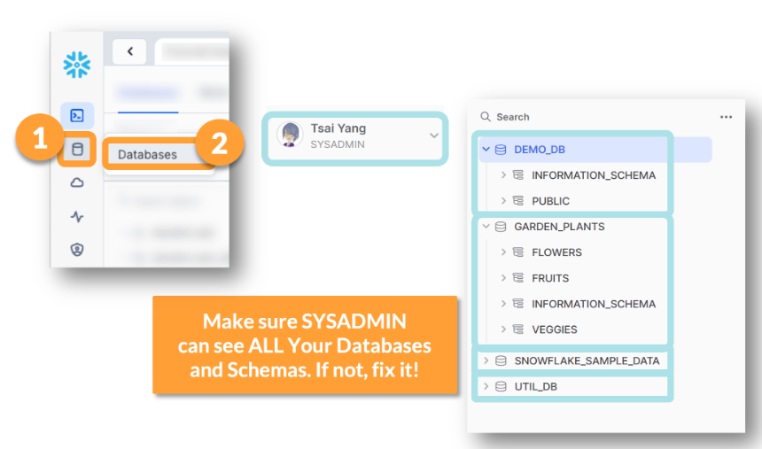


>Make sure SYSADMIN can see all the databases and schemas that have been created. If that role cannot see everything that ACCOUNTADMIN can see, FIX IT. As ACCOUNTADMIN you can Transfer Ownership or drop the object. Then, you can recreate the objects while your role is set to SYSADMIN. 

>Also, make sure there is no PUBLIC schema in the GARDEN_PLANTS database. You were supposed to delete that, remember?

>You will encounter issues later if this is not fixed now. 

>>DO NOT POST THE SOLUTION CODE IN THE DISCUSSION BELOW.  NEVER POST ANSWERS TO MULTIPLE CHOICE QUESTIONS. 

> You may ask clarifying in questions in the 📣 forum below, but please do not ask for or post the actual code needed to complete the task. 