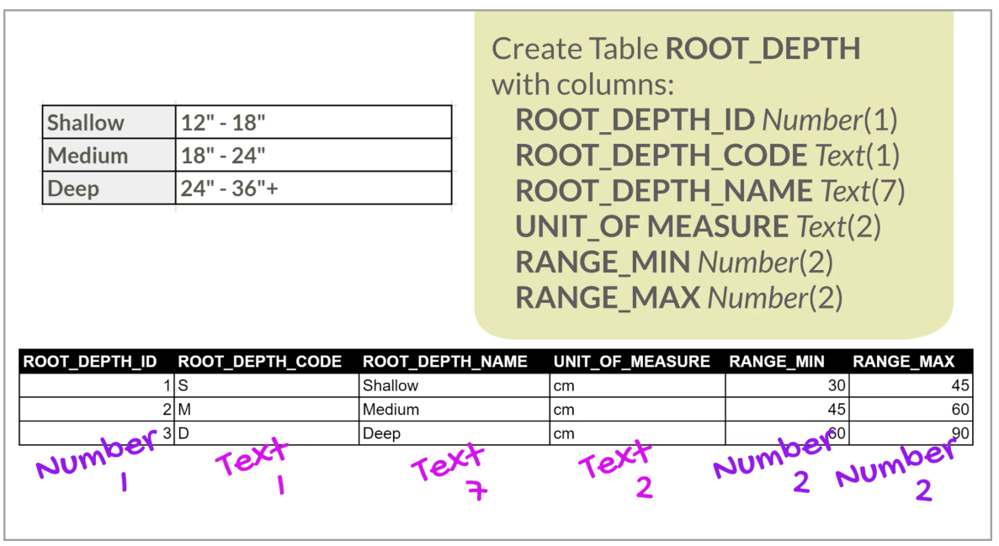
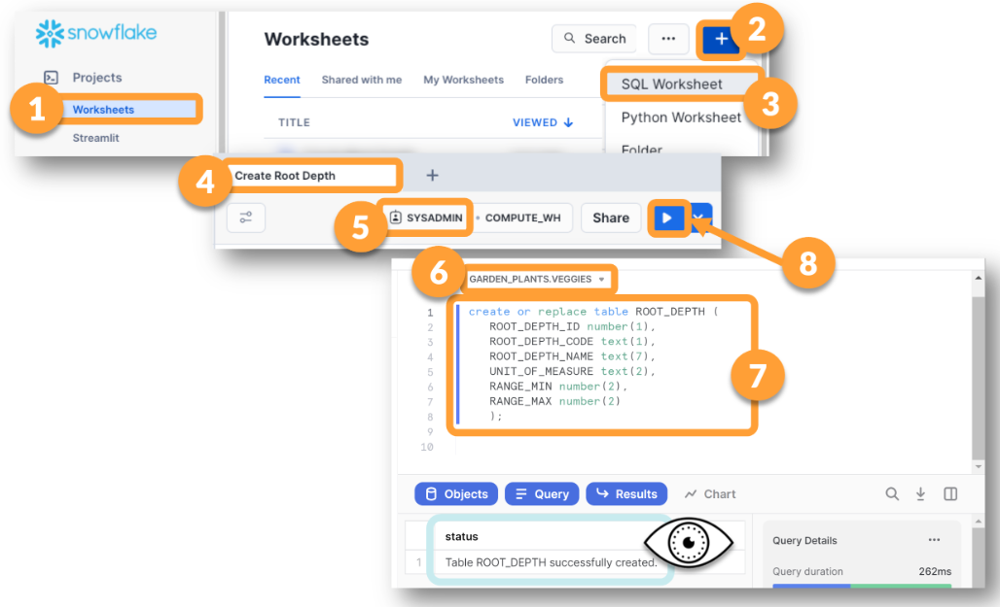

# Lesson 4: Tables, Data Types, and Loading Data

## 🎭 Uncle Yer Goes from Spreadsheets to SQLcurrent section


## 🥋 Create the ROOT_DEPTH Table

### 📓 Based on the Data, What Should Our Table Look Like? 



To read more about data types like TEXT, see Snowflake's online documentation [here](https://docs.snowflake.com/en/sql-reference/data-types-text#data-types-for-text-strings). 
To read more about data types like NUMBER, see Snowflake's online documentation [here](https://docs.snowflake.com/en/sql-reference/data-types-numeric#number).

### 🥋 Create Your ROOT_DEPTH Table

>You can use the steps shown below, or scroll further down and get the code to copy/paste.




```
use role sysadmin;
create or replace table GARDEN_PLANTS.VEGGIES.ROOT_DEPTH (
   ROOT_DEPTH_ID number(1), 
   ROOT_DEPTH_CODE text(1), 
   ROOT_DEPTH_NAME text(7), 
   UNIT_OF_MEASURE text(2),
   RANGE_MIN number(2),
   RANGE_MAX number(2)
   ); 
```

## 🥋 Find the Table You Just Created by Worksheets Object Picker in the Worksheets Sidebar


## 🥋 Insert a Row of Data into Your New Table


### 🥋  Getting Rows of Data Into Table
>Now that you have a table, you'll want to put some data into it. There are many ways to get data into tables, but we'll start with the simplest and move through several options. As we move away from the simplest options, we will learn more efficient and effective ways of loading data. 

?Before the end of this workshop you will have experience loading data: 

- Using an INSERT statement from the Worksheet. 
- Using the Load Data Wizard.
- Using COPY INTO statements. 


### 🥋  Use the Data Preview Option
Before you load a row of data into your table, first take note that your table has zero rows. GO TO A WORKSHEET, find the table in the Object Picker, click the table name to choose the table, look in the object details pane, and click on the the magnifying glass symbol.


#### NOTE: The preview symbol has changed slightly but it is still located in the same place. The icon still has a magnifying glass. We are confident you can find it! We believe in you. 


```
USE WAREHOUSE COMPUTE_WH;

INSERT INTO GARDEN_PLANT.VEGGIES.ROOT_DEPTH (
	ROOT_DEPTH_ID ,
	ROOT_DEPTH_CODE ,
	ROOT_DEPTH_NAME ,
	UNIT_OF_MEASURE ,
	RANGE_MIN ,
	RANGE_MAX 
)

VALUES
(
    1,
    'S',
    'Shallow',
    'cm',
    30,
    45
)
;
```

#### ❗ The Dreaded Does Not Exist Error
>>You will see this message. It's not that hard to fix. You either change your role, change the context menus in the worksheet, or fully qualify the object name by adding its full location.

>> Sometimes you need to change the ownership on something so it shows up. Sometimes you have to rename or move it. Ask yourself "Where am I looking for this thing? Is that where it is? Is that what it's named?" and "Who is looking for it? Does that role have access to it?"


## 📓 Select Stars and Limits

### 📓 Learning About Select Stars & Limits
> A Select Star statement starts with "SELECT *" (which is technically an asterisk). "Select Asterisk" takes longer to say. A Select Star is a way to ask for all columns in the table, without having to list them one by one. 

> If you want all columns but not all rows, you can run a Select Star with a LIMIT. Limits make sure that you get just a small set of rows. That way, if there are millions of rows, you won't waste compute power, getting all of them, if all you want to see are a few of them. 
```
SELECT *
FROM ROOT_DEPTH
LIMIT 1;
```
> Of course, our table only has one row right now, but later it will have more rows, and later we'll have other tables we create that we load with many more.  

## 🎯 Lesson 4 Challenge Lab


### 🎯 Add Two More Rows to the ROOT_DEPTH Table

```
USE WAREHOUSE COMPUTE_WH;

INSERT INTO GARDEN_PLANTS.VEGGIES.ROOT_DEPTH (
	ROOT_DEPTH_ID ,
	ROOT_DEPTH_CODE ,
	ROOT_DEPTH_NAME ,
	UNIT_OF_MEASURE ,
	RANGE_MIN ,
	RANGE_MAX 
)

VALUES
(
    2,
    'M',
    'Medium',
    'cm',
    45,
    60
)
;
```


## 🏁 Lesson 3 & 4 Wrap Up

### 🏁 Ready for Lesson 5? 

- Do you have 5 Databases?
- Are all 5 of them visible by ACCOUNTADMIN?
- Are all 5 of them visible by SYSADMIN?
- Does the GARDEN_PLANTS database have 4 Schemas? 
- Does the VEGGIES Schema have a single table called ROOT_DEPTH with 3 rows in it? 
- If you answer YES to all of these, you should proceed to lesson 5! - If not, you should go back and fix anything that isn't right!