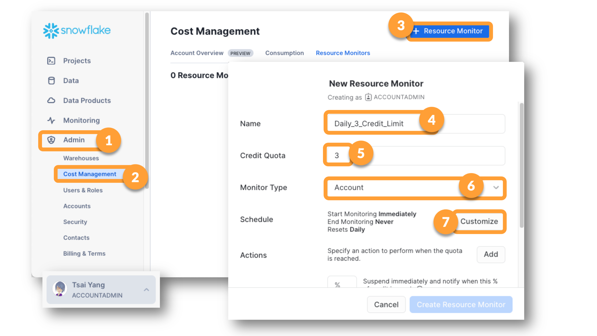
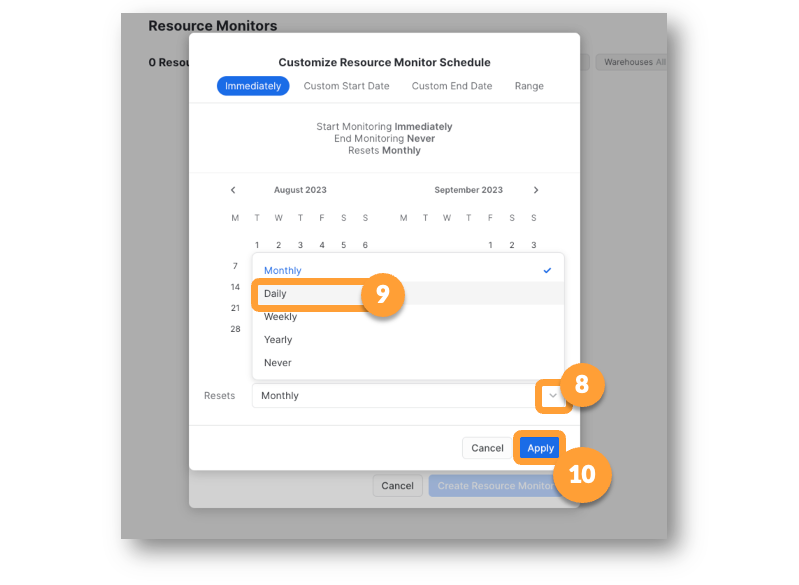
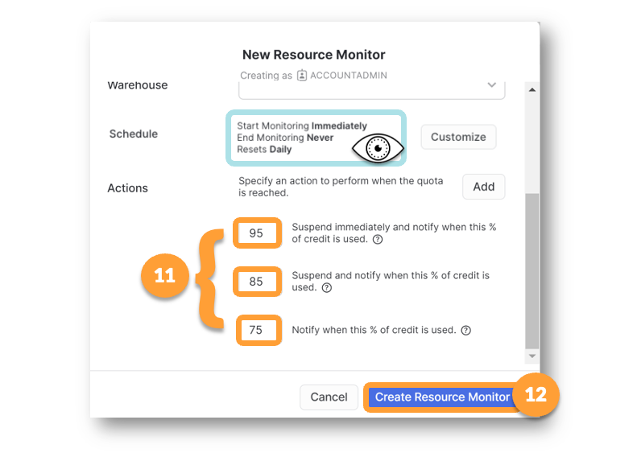

# Lesson 5 : Worksheets & Warehouses

## 🎭 Tsai Tells the Team About Worksheets & Warehousescurrent section

### 📓 Two Sets of Drop Menus, and a Key Difference Between Them
Of the four drop lists, two are REQUIRED and two are more or less OPTIONAL.

> ROLE and WAREHOUSE Drop Menu Values are REQUIRED

You cannot run a select statement without a warehouse to provide the compute power and you cannot run a select statement without a ROLE to define whether that data is accessible to the person* trying to run it. There are some minor exceptions, but for now, accept this as a rule.  

 * in this case the "person" is a USER with a current ROLE. 

> DATABASE and SCHEMA Drop Menu Values are SUGGESTED STARTING POINTS

The database and schema settings in a worksheet are just "home bases", or suggested starting places that tell Snowflake where to look for tables, views and other objects. These droplists exist so that you can simplify code and leave database and schema names out of your statements if you want to. Just because a Database is set in the menu, doesn't mean you can't run selects on other databases in the worksheet. 

## 🎭 What is a Warehouse in Snowflake?

### Defining "Warehouse" in Snowflake:
People who have been working with data for awhile might think of the term "Data Warehouse" as referring to a special collection of data structures, but in Snowflake, warehouses don't store data.
In Snowflake, Warehouses are "workforces" -- they are used to perform the processing of data. 
When you create a Warehouse in Snowflake, you are defining a "workforce."
### Teams are Clusters, Team Members are Servers: 
In the video, the workforce of each warehouse is a team. A small warehouse has a small team, but just one team. An extra-large warehouse has a large team, but just one team.  
Snowflake Warehouse Sizes like eXtra-Small, Small, Medium, etc. all have one cluster. A small warehouse has one cluster made up of just a few servers. A larger warehouse has one cluster, made up of more servers.
### Scaling Up and Down: 
Changing the size of warehouse changes the number of servers in the cluster. 
Changing the size of an existing warehouse is called scaling up or scaling down.
### Scaling In and Out: 
If multi-cluster/elastic warehousing is available (Enterprise edition or above) a warehouse is capable of scaling out in times of increased demand.  (Adding temporary teams, made up of a collection of temporary workers). 
If multi-cluster scaling out takes place, clusters are added for the period of demand and then clusters are removed (snap back) when demand decreases. (Removing temporary teams). 
The number of servers in the original cluster dictates the number of servers in each cluster during periods where the warehouse scales out by adding clusters. 

## 📓 Just Because You Can...

#### 📓 ...Doesn't Mean You SHOULD!!!
In Snowflake, you can bring ENORMOUS compute power into play in just a few seconds! We want you to know this is possible, especially if you have a big gnarly job that needs monster computing power. 

But, we also want you to know that most queries do not require MONSTER computing power. 

In fact, Snowflake recommends always starting with eXtra-Small warehouses and only scaling up if you find a compelling reason do that. XS warehouses cost less than five dollars to run for an hour. Our biggest warehouse, the 6XL, costs over 500 times that amount, because it's like running 512 XS warehouses at one time. 

Your free trial has 400 credits. This means you can run an XS for 400 hours or you can run a 6XL for less than one hour.  We don't extend the trials so if you use up your credits on big warehouses, you just have to start over. 

For this workshop and others in the Hands-On series, it's better to keep your warehouse set to XS except in cases where we ask you to use size S instead. 

For on-the-job Snowflake usage, you will likely have people who oversee the configuration of your warehouses. Warehouse over-sizing is simplest way to make mistakes that cause big surprises on the monthly invoice so it's best to get accustomed to using XS and S warehouses most of the time and scale up only after careful consideration.

Snowflake recommends that each account have people who oversee costs and will have advanced knowledge of how to best choose warehouse sizes and configure the elasticity settings. These cost administrators will also be able to calculate whether the a change in warehouse size will result in enough time savings to justify the costs incurred or even balance them out. 

#### 📓 Protecting Yourself from Surprises
Snowflake has many ways for you to monitor and control costs so that if someone makes a mistake, you'll know about it as quickly as possible. 

The easiest way to put a protection in place is to set up a Resource Monitor. Follow the directions below to put one in place to protect your Trial account. 

#### 🥋 Set Up A Resource Monitor

## 🏁 Lesson 5 Wrap Up

