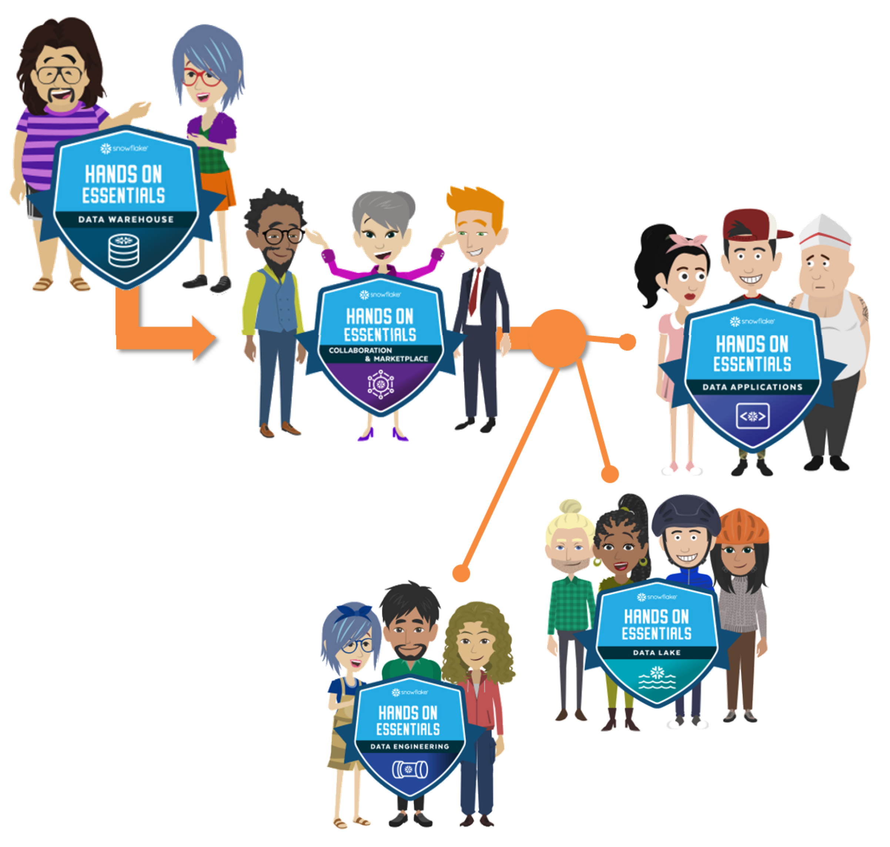

# Hands-On Badges
Hands-On work for Snowflake workloads, with proof of completion (badges)!

## Learning Path
- [Badge 1 : Data Warehousing Workshop](badge1_Data_Warehousing_Workshop/readme.md)

- [Badge 2: Collab, Marketplace & Cost Estimation Workshop](badge2_Collab,_Marketplace_Cost_Estimation_Workshop/readme.md)

- [Badge 3: Data Application Builders Workshop](badge3_Data_Application_Builders_Workshop/readme.md)

- [Badge 4: Data Lake Workshop](badge4_Data_Lake_Workshop/readme.md)

- [Badge 5: Data Engineering Workshop](badge5_Data_Engineering_Workshop/readme.md)

## Roadmap

